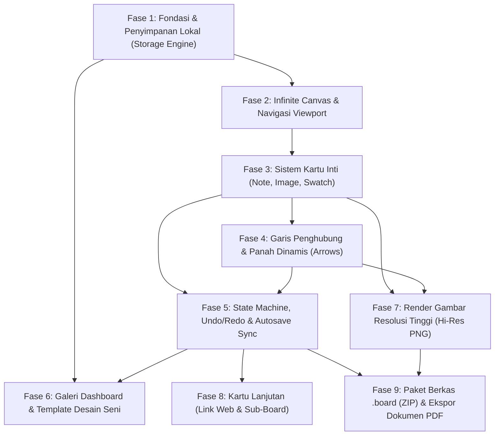

# LocalBoard — Implementation Plan & Technical Architecture

> **Project:** LocalBoard (Milanote Local-First for Art Students)  
> **Target AI Model:** Gemini 3.8 Flash (High)  
> **Source of Truth:** [PRD.md](file:///Users/normeno/Documents/Personal/Milanote%20KW/Markdown/PRD.md) & [AGENTS.md](file:///Users/normeno/Documents/Personal/Milanote%20KW/Markdown/AGENTS.md)  
> **Status:** Approved for Implementation

---

## 1. Executive & Architecture Summary

LocalBoard adalah aplikasi kanvas visual tak terbatas (*infinite canvas*) berbasis *local-first* dan *offline-first* yang dirancang khusus untuk mahasiswa seni, desainer, dan praktisi visual. Seluruh data, gambar, dan proyek tersimpan 100% secara lokal di perangkat tanpa dependensi server atau langganan berbayar.

### 1.1 Pola Arsitektur: Feature-First dengan State Machine Riverpod
Sesuai panduan di [AGENTS.md](file:///Users/normeno/Documents/Personal/Milanote%20KW/Markdown/AGENTS.md), proyek ini menggunakan struktur direktori **Feature-First** dengan *unidirectional reactive data flow*:

```
lib/
├── app/                  # Inisialisasi tema Studio, konfigurasi rute, dan global providers
│   ├── app.dart
│   ├── router.dart
│   └── theme.dart        # Studio Dark (Charcoal/Slate) & Studio Light (Soft Off-White)
├── core/                 # Shared utilities, token desain, konstanta, matematika kurva
│   ├── constants/        # Batasan kanvas, skala zoom (10% - 400%), batas z-index
│   ├── theme/            # Palet warna studio netral, tipografi Inter/Grotesk
│   └── utils/            # Bounding box math, bezier curves, platform helpers
├── features/
│   ├── storage/          # US-010: Database lokal (Hive), asset sandboxing, autosave engine
│   │   ├── data/         # Hive adapters, file system I/O, asset copy engine
│   │   └── domain/       # Storage contracts, autosave stream, snapshot serialization
│   ├── canvas/           # US-003: Infinite canvas viewport, transformation, dot-grid
│   │   ├── controller/   # Canvas transformation controller, zoom/pan state, hit-test
│   │   └── widgets/      # CanvasViewport, DotGridPainter, CanvasOverlayControls
│   ├── cards/            # US-004 s/d US-009: Note, Image, Swatch, Link, Arrow, SubBoard
│   │   ├── models/       # Model kartu imutabel (BaseCard, NoteCard, ImageCard, dll.)
│   │   └── widgets/      # DraggableCardWrapper (drag, selection, resize, RepaintBoundary)
│   ├── history/          # FR-18: Command-based Undo / Redo engine (50 langkah)
│   │   ├── models/       # CanvasAction (Move, Resize, ContentChange, Add, Delete)
│   │   └── controller/   # HistoryController dengan circular buffer
│   ├── gallery/          # US-001: Dashboard galeri papan, search filter, manajemen proyek
│   │   ├── data/         # Board metadata repository
│   │   └── presentation/ # GalleryScreen, BoardThumbnailCard, Rename/Delete dialogs
│   ├── templates/        # US-002: Starter template (Karakter, Storyboard, Warna, Brainstorm)
│   │   └── domain/       # Inisialisasi template kanvas awal
│   └── export_import/    # US-011 & US-012: Format .board (ZIP), Hi-Res PNG, PDF
│       ├── image_export/ # RenderRepaintBoundary rasterizer dengan skala 1x, 2x, 3x
│       ├── pdf_export/   # Generator PDF poster 1 lembar & multi-halaman
│       └── board_bundle/ # ZipEncoder/ZipDecoder isolate worker untuk format .board
└── main.dart             # Dependency bootstrap, inisialisasi Hive, konfigurasi Window
```

---

## 2. Resolusi Ambiguitas & Keputusan Teknis

| Area | Alternatif | Keputusan Teknis | Alasan Teknis |
| :--- | :--- | :--- | :--- |
| **Database Lokal** | `drift` (SQLite) vs `hive_flutter` | **`hive_flutter` (Key-Value Document Store)** | Pure Dart, bebas masalah kompilasi C library / FFI di macOS/Windows/Web; sangat cepat untuk baca/tulis pohon dokumen JSON kanvas. |
| **Viewport Kanvas** | Custom `CustomPainter` gestures vs `InteractiveViewer` | **`InteractiveViewer` + custom `TransformationController`** | Menyediakan inersia pan, gestur pinch trackpad/touch, dan zoom-to-cursor tanpa perlu menulis ulang matematika matriks affine dari nol. |
| **Manajemen Memori Gambar** | Pemuatan `Image.file` mentah vs Tekstur berskala | **`ResizeImage` + isolasi thumbnail generator** | Mahasiswa sering memasukkan foto kamera 24MP–48MP. Pemuatan mentah memicu GPU *out-of-memory*; pembatasan dimensi ke resolusi kanvas menjaga 60/120 FPS stabil. |
| **Undo / Redo** | Snapshot kanvas penuh vs Granular Command Action | **Granular Action Stack (`CanvasAction`)** | Menyimpan 50 salinan kanvas utuh memboroskan RAM. Menyimpan delta tindakan atomik (`MoveAction`, `ResizeAction`, `ContentAction`) menjaga footprint memori < 2MB. |
| **Autosave Timing** | Tulis sinkron terus menerus vs Debounced event loop | **Debounce 400ms + Lifecycle Flush** | Mencegah thrashing I/O disk saat menggeser kartu; `AppLifecycleListener` menjamin data langsung disimpan saat aplikasi diminimalkan atau ditutup. |
| **Aset Lintas Platform** | Path absolut sistem operasi vs Path UUID relatif | **Relative Sandboxed Asset (`assets/<uuid>.<ext>`)** | Path absolut rusak saat berkas dipindahkan antar-OS (macOS `/Users/...` vs Windows `C:\...`). Path UUID relatif menjamin arsip `.board` 100% portabel. |

---

## 3. Pemisahan Lingkup: MVP (v1) vs Post-MVP (v2)

### A. Fitur Inti MVP (v1 Core — Non-Negotiable)
1. **Navigasi Kanvas Tanpa Batas (US-003):** Panning halus, zoom (10%–400%), motif titik (*dot-grid*), kontrol overlay (Reset 100%, Fit-to-View).
2. **Penyimpanan Lokal & Autosave (US-010):** Integrasi Hive, debounce 400ms, jaminan *zero data loss*.
3. **3 Kartu Visual Utama:**
   - **Kartu Catatan (US-004):** Rich text (headings, bold, italic, bullet list, checklists), pilihan warna pastel, pengubahan ukuran bebas.
   - **Kartu Gambar (US-005):** Drag-and-drop dari OS (`desktop_drop`), tempel dari clipboard (Ctrl/Cmd+V via `pasteboard`), proportional resize, lightbox preview.
   - **Kartu Palet Warna (US-007):** 1–8 swatch warna, visual color picker, salin kode HEX 1-klik ke clipboard.
4. **Panah Penghubung Dinamis (US-008):** Garis lurus, lengkung bezier, dan siku yang otomatis mengikuti pergerakan kartu.
5. **Sistem Undo / Redo (FR-18):** Riwayat tindakan kanvas (maks. 50 aksi) dengan shortcut keyboard Ctrl+Z dan Ctrl+Y.
6. **Dashboard Galeri & Template (US-001, US-002):** Pratinjau thumbnail, pencarian nama papan, serta 4 template seni siap pakai.
7. **Ekspor PNG Hi-Res (US-012 part 1):** Bounding-box otomatis seluruh elemen dengan opsi resolusi 1x, 2x, dan 3x.
8. **Estetika Studio Visual (FR-19):** Tema Studio Dark (Charcoal) dan Studio Light (Soft Off-White) dengan toolbar dock melayang.

### B. Fitur Lanjutan Post-MVP (v1.5 / v2)
- **Kartu Tautan Web (US-006):** Scraper metadata Open Graph dan caching offline gambar cover.
- **Sub-Board Bersarang (US-009):** Papan di dalam papan dengan navigasi *breadcrumb*.
- **Format Berkas `.board` (US-011):** Paket arsip mandiri ZIP berisi JSON dan direktori `assets/`.
- **Ekspor Dokumen PDF (US-012 part 2):** Dokumen PDF poster 1 lembar atau multi-halaman siap cetak.

---

## 4. Matriks Risiko & Strategi Mitigasi

| No | Risiko Teknis | Potensi Dampak | Strategi Mitigasi |
| :--- | :--- | :--- | :--- |
| 1 | **Infinite Canvas FPS Drop** | Penurunan performa (<30 FPS) saat memuat >50 kartu dan gambar | Bungkus setiap kartu dalam `RepaintBoundary`; render dot-grid menggunakan modulo matematika di `CustomPainter` tanpa widget fisik; aktifkan viewport culling. |
| 2 | **Image Storage & RAM Exhaustion** | GPU out-of-memory saat mengimpor puluhan foto kamera resolusi tinggi | Salin aset ke storage lokal aplikasi; gunakan `ResizeImage` sesuai ukuran tampilan kartu; bersihkan aset yatim saat kartu dihapus. |
| 3 | **Autosave Thrashing / Data Corruption** | Bottleneck disk I/O dan risiko data rusak jika aplikasi mati mendadak | Debounce timer 400ms saat interaksi pointer aktif; gunakan penulisan berkas atomik (file temporer lalu rename); dengarkan `AppLifecycleListener` untuk flush seketika. |
| 4 | **Undo / Redo State Drift** | Memori membengkak jika menyimpan snapshot penuh; garis panah putus | Gunakan Command Pattern (`CanvasAction`) yang hanya mencatat delta aksi; panah mengikat `CardId` sehingga perpindahan kartu tidak menduplikasi aksi panah. |
| 5 | **Portabilitas Berkas `.board`** | File diekspor di Mac gagal dibuka di Windows karena perbedaan separator path (`/` vs `\`) | Enforce tanda garis miring POSIX (`/`) di manifest ZIP; aset hanya menggunakan nama berkas UUID standar tanpa karakter khusus; validasi manifest JSON sebelum ekstraksi. |
| 6 | **Akses File & Clipboard Lintas Platform** | `desktop_drop` atau `pasteboard` diblokir oleh sandbox OS | Buat lapisan abstraksi service; atur entitlement sandbox macOS (`com.apple.security.files.user-selected.read-write`); sediakan fallback pemilih file biasa (`file_picker`). |
| 7 | **Limitasi Offline Flutter Web** | Kuota IndexedDB browser terbatas & dapat dibersihkan otomatis oleh OS browser | Prioritaskan Desktop (macOS/Windows) dan Tablet; pada Web tampilkan notifikasi ramah agar pengguna sering mengunduh cadangan berkas `.board`. |

---

## 5. Grafik Dependensi Antar-Fase (*Dependency Graph*)



---

## 6. Rincian Fase Implementasi

### Fase 1: Fondasi & Penyimpanan Lokal (Storage Engine)
- **Tujuan:** Menyiapkan struktur proyek Flutter, mengonfigurasi tema Studio, Riverpod, Hive, dan Asset Manager untuk gambar lokal.
- **Berkas Terdampak:** `pubspec.yaml`, `lib/main.dart`, `lib/app/theme.dart`, `lib/core/constants/canvas_constants.dart`, `lib/features/storage/domain/board_repository.dart`, `lib/features/storage/data/hive_board_repository.dart`, `lib/features/storage/data/asset_manager.dart`.
- **Dependensi:** Tidak ada (fondasi awal).
- **Kriteria Penerimaan:** Proyek lulus `flutter analyze` tanpa warning; Hive terinisialisasi di direktori dokumen aplikasi; Asset Manager mampu menyimpan, membaca, dan menghapus byte gambar dengan UUID.
- **Pengujian:** Unit test operasi CRUD metadata papan & penyimpanan asset disk.
- **Metode Verifikasi:** `flutter test` dan eksekusi build awal aplikasi.

### Fase 2: Infinite Canvas Viewport & Navigasi
- **Tujuan:** Membangun viewport kanvas tak terbatas dengan pan, zoom halus (10%–400%), dot-grid dinamis, dan kontrol overlay.
- **Berkas Terdampak:** `lib/features/canvas/controller/canvas_controller.dart`, `lib/features/canvas/widgets/canvas_viewport.dart`, `lib/features/canvas/widgets/dot_grid_painter.dart`, `lib/features/canvas/widgets/canvas_overlay_controls.dart`.
- **Dependensi:** Fase 1.
- **Kriteria Penerimaan:** Kanvas dapat digeser ke segala arah; zoom berpusat pada kursor/titik sentuh; dot grid menyesuaikan perbesaran; tombol Reset Zoom dan Fit-to-View berfungsi stabil pada 60+ FPS.
- **Pengujian:** Widget test gestur pan & zoom; unit test konversi koordinat layar ke koordinat kanvas.
- **Metode Verifikasi:** Navigasi interaktif menggunakan mouse wheel dan trackpad pinch; periksa stabilitas frame rate di DevTools.

### Fase 3: Sistem Kartu Inti (Note, Image, Swatch)
- **Tujuan:** Menyediakan kartu Catatan, Gambar, dan Palet Warna yang dapat digeser bebas dan diubah ukurannya di atas kanvas dengan isolasi repaint.
- **Berkas Terdampak:** `lib/features/cards/models/base_card.dart`, `lib/features/cards/models/note_card.dart`, `lib/features/cards/models/image_card.dart`, `lib/features/cards/models/color_card.dart`, `lib/features/cards/widgets/card_wrapper.dart`, `lib/features/cards/widgets/note_card_widget.dart`, `lib/features/cards/widgets/image_card_widget.dart`, `lib/features/cards/widgets/color_card_widget.dart`, `lib/features/cards/widgets/floating_toolbar.dart`.
- **Dependensi:** Fase 2.
- **Kriteria Penerimaan:** Kartu dapat digeser tanpa memicu pergeseran kanvas; pengubahan ukuran mempertahankan batas minimum; gambar dapat dimasukkan via drag-and-drop dan Ctrl+V; kartu warna menampilkan kode HEX dan tombol salin 1-klik.
- **Pengujian:** Unit test model kartu (JSON serialization & `copyWith`); widget test checklist toggle dan handle resize.
- **Metode Verifikasi:** Seret file dari Finder/Explorer dan paste gambar dari web; uji kelancaran pengubahan ukuran.

### Fase 4: Garis Penghubung & Panah Dinamis
- **Tujuan:** Menghubungkan dua kartu menggunakan garis panah dinamis yang memperbarui posisinya secara otomatis saat kartu dipindahkan.
- **Berkas Terdampak:** `lib/features/cards/models/connector_arrow.dart`, `lib/features/cards/widgets/arrow_painter.dart`, `lib/features/cards/widgets/card_anchor_points.dart`, `lib/core/utils/bezier_math.dart`.
- **Dependensi:** Fase 3.
- **Kriteria Penerimaan:** Menghubungkan titik jangkar antar-kartu; mendukung gaya garis Lurus, Lengkung (Bezier), dan Siku; panah tetap terhubung saat salah satu atau kedua kartu digeser.
- **Pengujian:** Unit test matematika kurva bezier; kalkulasi posisi anchor point kartu.
- **Metode Verifikasi:** Geser kartu yang terhubung secara acak; amati kelancaran pembaharuan kurva dan ujung panah.

### Fase 5: State Machine, Undo/Redo & Autosave Sync
- **Tujuan:** Mengintegrasikan mutasi kanvas ke Riverpod, riwayat Undo/Redo (Ctrl+Z/Ctrl+Y), dan autosave 400ms debounce.
- **Berkas Terdampak:** `lib/features/history/models/canvas_action.dart`, `lib/features/history/controller/history_controller.dart`, `lib/features/canvas/controller/board_state_notifier.dart`, `lib/features/storage/domain/autosave_service.dart`.
- **Dependensi:** Fase 3 & 4.
- **Kriteria Penerimaan:** Setiap aksi kanvas dapat di-undo dan re-do; status autosave menampilkan indikator halus "Semua perubahan tersimpan di lokal"; data tetap utuh saat aplikasi ditutup paksa.
- **Pengujian:** Unit test stack riwayat history (50 buffer); unit test debounce autosave.
- **Metode Verifikasi:** Buat kartu, hapus, geser, tekan Ctrl+Z / Ctrl+Y berkali-kali, tutup paksa aplikasi, lalu buka kembali untuk memastikan konsistensi kanvas.

### Fase 6: Galeri Dashboard & Starter Template
- **Tujuan:** Menampilkan grid seluruh papan lokal, pencarian, menu opsi papan, serta 4 template seni siap pakai.
- **Berkas Terdampak:** `lib/features/gallery/presentation/gallery_screen.dart`, `lib/features/templates/domain/starter_templates.dart`, `lib/features/gallery/presentation/widgets/board_grid_card.dart`, `lib/features/gallery/presentation/widgets/template_selection_modal.dart`.
- **Dependensi:** Fase 1 & 5.
- **Kriteria Penerimaan:** Dashboard menampilkan thumbnail pratinjau, tanggal modifikasi, pencarian instan, duplikasi papan, dan inisialisasi template (Karakter, Storyboard, Studi Gaya & Warna, Brainstorming).
- **Pengujian:** Widget test filter search bar galeri; unit test duplikasi papan independen (deep clone).
- **Metode Verifikasi:** Buat papan dari seluruh 4 template; uji duplikasi dan penghapusan dengan dialog konfirmasi.

### Fase 7: Render Gambar Resolusi Tinggi (Hi-Res PNG)
- **Tujuan:** Menghitung bounding box seluruh elemen dan mengekspor moodboard ke PNG beresolusi tinggi (skala 1x, 2x, 3x).
- **Berkas Terdampak:** `lib/core/utils/bounding_box_calculator.dart`, `lib/features/export_import/image_export/canvas_rasterizer.dart`, `lib/features/export_import/image_export/export_preview_dialog.dart`.
- **Dependensi:** Fase 3, 4 & 5.
- **Kriteria Penerimaan:** Menghitung batas terluar seluruh kartu dengan margin yang rapi; pratinjau sebelum menyimpan; ekspor 1x, 2x, 3x tersimpan via dialog simpan file standar OS.
- **Pengujian:** Unit test bounding box calculator pada berbagai kombinasi koordinat.
- **Metode Verifikasi:** Ekspor papan berisi 20+ elemen ke PNG 2x dan 3x; periksa kejernihan piksel dan tidak ada kartu yang terpotong.

### Fase 8: Kartu Lanjutan (Link Web & Sub-Board)
- **Tujuan:** Menambahkan kartu bookmark tautan web dengan scraping Open Graph & offline caching serta kartu sub-board bersarang dengan navigasi remah roti (*breadcrumb*).
- **Berkas Terdampak:** `lib/features/cards/models/link_card.dart`, `lib/features/cards/models/subboard_card.dart`, `lib/features/cards/widgets/link_card_widget.dart`, `lib/features/cards/widgets/subboard_card_widget.dart`, `lib/features/cards/services/opengraph_scraper.dart`, `lib/features/canvas/widgets/breadcrumb_bar.dart`.
- **Dependensi:** Fase 3, 5 & 6.
- **Kriteria Penerimaan:** Memasukkan link web otomatis memuat judul dan gambar cover yang dicache secara lokal; klik ganda sub-board membuka kanvas anak; breadcrumb memungkinkan kembali ke papan induk dengan 1 klik.
- **Pengujian:** Unit test OpenGraph parser dengan mock HTML; unit test navigasi hirarki papan induk-anak.
- **Metode Verifikasi:** Tempelkan link Pinterest/YouTube, matikan koneksi internet untuk memverifikasi cover tetap muncul; buat sub-board hingga 3 level kedalaman.

### Fase 9: Format Berkas `.board` (ZIP) & Ekspor Dokumen PDF
- **Tujuan:** Menyediakan portabilitas proyek mandiri melalui file arsip `.board` (JSON + aset gambar) dan konversi dokumen PDF poster/multi-halaman.
- **Berkas Terdampak:** `lib/features/export_import/board_bundle/board_bundle_service.dart`, `lib/features/export_import/board_bundle/manifest_schema.dart`, `lib/features/export_import/pdf_export/pdf_generator.dart`.
- **Dependensi:** Fase 5, 7 & 8.
- **Kriteria Penerimaan:** Ekspor membungkus seluruh data dan file gambar ke dalam file `.board` di latar belakang (*isolate*); impor memvalidasi integritas file dan menampilkan di galeri; PDF poster dapat dicetak atau disimpan.
- **Pengujian:** Unit test zip encoding & decoding dengan verifikasi checksum; unit test pemecahan halaman PDF.
- **Metode Verifikasi:** Ekspor file `.board`, hapus papan asli, impor kembali file tersebut, dan pastikan seluruh gambar, teks, dan posisi kartu pulih 100%.

---

## 7. Master Task List dengan ID Unik

| Task ID | Nama Tugas | Fase | Deskripsi Singkat |
| :--- | :--- | :--- | :--- |
| **`FND-01`** | Setup Proyek Flutter & Dependencies | Fase 1 | Konfigurasi `pubspec.yaml` (`flutter_riverpod`, `hive_flutter`, `path_provider`, `uuid`). |
| **`FND-02`** | Design System Studio Dark & Light | Fase 1 | Implementasi token warna netral arang & off-white di `lib/app/theme.dart`. |
| **`FND-03`** | Asset Manager & Sandboxing | Fase 1 | Penyimpanan file gambar lokal dengan penamaan UUID di folder dokumen aplikasi. |
| **`FND-04`** | Hive Board Repository | Fase 1 | Operasi CRUD metadata papan dan data kartu kanvas di Hive. |
| **`CNV-01`** | Canvas Transformation Controller | Fase 2 | Manajemen matriks zoom (0.1x–4.0x) dan zoom berpusat pada kursor. |
| **`CNV-02`** | Dot-Grid CustomPainter | Fase 2 | Render titik grid latar belakang berbasis modulo matematika (bebas lag 60 FPS). |
| **`CNV-03`** | Canvas Viewport Widget | Fase 2 | Integrasi viewport `InteractiveViewer` dengan layer kartu dan gesture separator. |
| **`CNV-04`** | Canvas Overlay & Fit-to-View | Fase 2 | Indikator persentase zoom, tombol Reset Zoom (100%), dan kalkulasi Fit-to-View. |
| **`CRD-01`** | Model Data Kartu Imutabel | Fase 3 | Definisi model `BaseCard`, `NoteCard`, `ImageCard`, `ColorCard` dengan `copyWith`. |
| **`CRD-02`** | Draggable Card Wrapper | Fase 3 | Handle drag bebas, seleksi, handle resize, dan isolasi `RepaintBoundary`. |
| **`CRD-03`** | Note Card Widget | Fase 3 | Komponen teks rich note, checklist to-do, dan pemilih warna latar pastel. |
| **`CRD-04`** | Image Card Widget | Fase 3 | Drag-and-drop dari OS (`desktop_drop`), Ctrl+V (`pasteboard`), dan lightbox. |
| **`CRD-05`** | Color Swatch Card Widget | Fase 3 | Deretan 1–8 swatch warna, visual color picker, dan salin HEX 1-klik ke clipboard. |
| **`CRD-06`** | Floating Toolbar Dock | Fase 3 | Dock alat melayang di sisi kiri/bawah untuk menarik kartu baru ke kanvas. |
| **`ARW-01`** | Connector Arrow Model | Fase 4 | Model koneksi antar-kartu (start/end card ID, anchor point, style, arrowhead). |
| **`ARW-02`** | Bezier & Orthogonal Math | Fase 4 | Algoritma kurva bezier halus dan elbow routing untuk garis siku. |
| **`ARW-03`** | Dynamic Arrow Painter | Fase 4 | Pelukis vektor panah yang otomatis tersinkronisasi dengan posisi kartu. |
| **`ARW-04`** | Interactive Card Anchors | Fase 4 | Titik jangkar interaktif di 4 sisi kartu untuk menarik garis koneksi baru. |
| **`STS-01`** | Riverpod Board State Notifier | Fase 5 | State notifier pusat pengelola daftar kartu, seleksi, dan status kanvas. |
| **`STS-02`** | Undo / Redo History Controller | Fase 5 | Command stack (50 langkah) dengan shortcut keyboard Ctrl+Z dan Ctrl+Y. |
| **`STS-03`** | Autosave Engine Debounce | Fase 5 | Timer debounce 400ms dan listener lifecycle app untuk zero data loss. |
| **`GAL-01`** | Dashboard Gallery Screen | Fase 6 | Tampilan grid papan lokal, pencarian real-time, dan kartu pratinjau thumbnail. |
| **`GAL-02`** | Artistic Starter Templates | Fase 6 | Generator template: Desain Karakter, Studi Warna, Storyboard, Brainstorming. |
| **`GAL-03`** | Manajemen Papan (Rename/Duplicate/Delete) | Fase 6 | Dialog ganti nama, duplikasi deep-copy, dan hapus dengan dialog ramah pemula. |
| **`EXP-01`** | Bounding Box Calculator | Fase 7 | Kalkulator batas terluar kanvas dengan margin proporsional. |
| **`EXP-02`** | Hi-Res Canvas Rasterizer | Fase 7 | Render offscreen pixel buffer dengan opsi resolusi 1x, 2x, dan 3x. |
| **`EXP-03`** | Export Preview Dialog | Fase 7 | Dialog pratinjau hasil render dan pemanggil file picker sistem operasi. |
| **`ADV-01`** | Open Graph Scraper & Image Cache | Fase 8 | Pengambil metadata web (judul, deskripsi, cover) dengan caching offline. |
| **`ADV-02`** | Link Bookmark Card Widget | Fase 8 | Kartu tautan web visual dan pembuka URL ke browser sistem bawaan. |
| **`ADV-03`** | Sub-Board Card & Breadcrumbs | Fase 8 | Kartu kontainer sub-board dan bilah navigasi hirarki remah roti. |
| **`PKG-01`** | Schema Manifest Format `.board` | Fase 9 | Spesifikasi manifest JSON dan struktur ZIP (`manifest.json`, `canvas_data.json`, `assets/`). |
| **`PKG-02`** | Board Bundle Service (ZIP Engine) | Fase 9 | Pemaketan dan ekstraksi file `.board` di latar belakang (*isolate/compute*). |
| **`PKG-03`** | PDF Document Generator | Fase 9 | Konversi moodboard ke format PDF poster 1 lembar atau dokumen multi-halaman. |

---

## 8. Strategi Verifikasi (*Verification Strategy*)

1. **Analisis Statis & Tipe:**
   - Menjalankan `flutter analyze` pada setiap akhir fase untuk memastikan 0 peringatan lint dan *sound null safety*.
2. **Stress Test Kanvas (FPS Benchmark):**
   - Menjalankan papan uji dengan 100+ kartu (50 teks, 30 gambar 4K, 20 swatch warna, 30 panah konektor) di Flutter DevTools Performance overlay. Memastikan waktu render tetap berada di bawah **16.6 ms** (menjamin 60 FPS stabil).
3. **Uji Keandalan Data (*Zero Data Loss*):**
   - Memindahkan dan mengedit kartu secara cepat, lalu mematikan proses aplikasi secara paksa (`kill -9`). Saat dibuka kembali, 100% posisi dan teks kartu harus persis di kondisi terakhir.
4. **Uji Portabilitas File `.board`:**
   - Mengekspor papan di macOS, memvalidasi struktur arsip melalui terminal (`unzip -l`), lalu mengimpornya kembali di sesi baru untuk memastikan tidak ada aset gambar atau koordinat yang meleset.
5. **Uji Pengalaman Orang Awam (*Art Students*):**
   - Memastikan tidak ada pesan kesalahan teknis (seperti *stack trace* atau dialog I/O raw); semua teks menggunakan bahasa yang ramah, visual, dan jelas.
